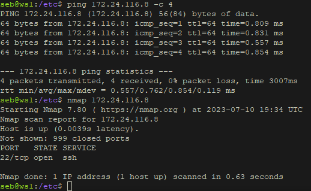
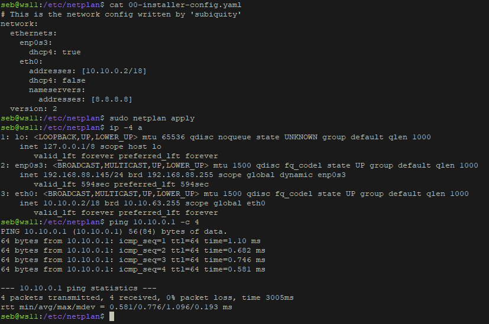

## Part 1. ipcalc tool
1. network address of `192.167.38.54/13` is `192.160.0.0`
1. conversion of:
   
    + the mask `255.255.255.0` to prefix and binary is `/24` and `11111111.11111111.11111111.00000000`
    + `/15` to normal and binary is `255.254.0.0` and `11111111.11111110.00000000.00000000`
    + `11111111.11111111.11111111.11110000` to normal and prefix is `255.255.255.240` and `/28`

1. minimum and maximum host in `12.167.38.4` network with masks:
    + `/8` is `12.0.0.1` and `12.255.255.254`
    + `11111111.11111111.00000000.00000000` is `12.167.0.1` and `12.167.255.254`
    + 255.255.254.0 is `12.167.38.1` and `12.167.39.254`
    + `/4` is `15.255.255.254` and `15.255.255.255`

1. an application running on localhost
   + can be accessed with the following IPs: `127.0.0.2`, `127.1.0.1`
   + can't be accessed with the following IPs: `194.34.23.100`, `128.0.0.1`
1. IPs that can be used as public:
    + `134.43.0.2`, `172.0.2.1`, `192.172.0.1`, `172.68.0.2`, `192.169.168.1`
  
    IPs that can only be used as private:

    + `10.0.0.45`, `192.168.4.2`, `172.20.250.4`, `172.16.255.255`, `10.10.10.10`

2. possible gateway IP addresses for 10.10.0.0/18 are: `10.10.0.2`, `10.10.10.10`, `10.10.1.255` (`10.0.0.1`, `10.10.100.1` are not possible). 

## Part 2. Static routing between two machines

1. output of `ip a` command on `ws1` and `ws2`

    

    

1. `enp0s8` is the local network between `ws1` and `ws2`

    

    

    restart of the network services:

    

    

2. static routes with `ip r` add
  
    

    

1. static routes with `netplan config`

    

    
    
## Part 3. iperf3 utility

1. 8 Mbps = 1 MB/s
   
   100 MB/s = 800000 Kbps

   1 Gbps = 1000 Mbps

1. `iperf` server running on `ws2`
   
   

   `iperf` client running on `ws1`

   

## Part 4. Network firewall

1. firewall on `ws1`
    
    
    
    

    
    firewall on `ws2`
    
    
    
    

2. The difference is that the `first` found rule applies, so for `ws1` pings will be be dropped and for `ws2` will not.

3. output of `ping` and `nmap` for `ws1` and `ws2`
   
   

   

## Part 5. Static network routing

1. `ws22` machine configuration
   
   

   `r1` machine configuration
   
   

   `r2` machine configuration
   
   

    `ws11` machine configuration and `ping` to `r1`
   
   

   `ws21` machine configuration and `ping` to `ws22`
   
   

1. enabling IP forwarding via `sysctl` 
   
   

   

   enabling IP forwarding via `/etc/sysctl.conf`

   

   

1. `ws11` default route configuration:
   
    

    `ws21` default route configuration:
   
    

    `ws22` default route configuration:
   
    

    ping `r2` router from `ws11`

    

    

1. static route to `10.20.0.0` on `r1`
   
   

   static route to `10.10.0.0` on `r2`
   
   

   `ip r list 10.10.0.0/18` and `ip r list 0.0.0.0/0` commands on `ws11`

   

   the route 10.10.0.0/18 is selected because it's more specific (longer prefix), also packets will be routed via the default route, if the routing table has no other routes, that can be used, which is not the case here.

1. `traceroute` call from `ws11` to `ws21`
   
   

   `tcpdump` on `r1`

   

   `Traceroute` is used to track the `path` of a packet on an IP network from source to destination.
   
   According to dump we can see that it uses `"Time to Live"` (`TTL`) mechanism. The source sending packets with increasing `TTL` for each hop until it gets to the destination (from `1` to `3` in the dump). The `TTL` value specifies how many routers the packet can pass through before being discarded. With each passed route `TTL` decreases.
   
   After the packet is discarded (`TTL` after decreasing equals `0`) the destination sends a packet to the source with `"ICMP time exceeded"` if the packet didn't reach the destination and `"Echo Reply"` if the destination is reached. 
   
   Traceroute also uses `3` packets on each hop to get a more accurate average of the round-trip time. You can change the amount of packets with `-q` option.

1. traffic capture going through `eth0` on `r1`
   
   

   ping a non-existent IP `10.30.0.111` from `ws11`:

   

